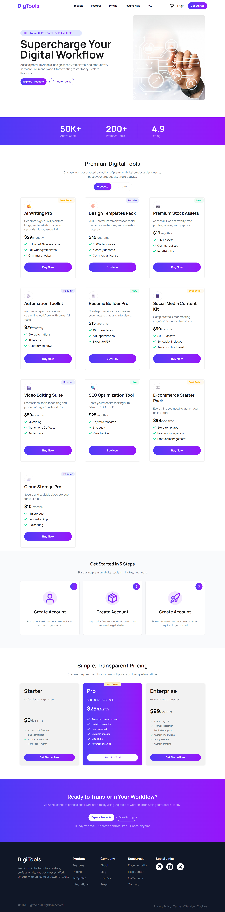

# Project Name: digital tools shop

# Description:
###  A modern and responsive product pricing card system built with React and Tailwind CSS. It features dynamic product display, filtering by tags, and total price calculatio

### A modern digital platform that provides AI-powered tools, premium templates, and productivity solutions to help users work faster, smarter, and more effectively.

# Technology:
* React JS
* Tailwind CSS
* Daisy UI
* Java Script 
* HTML5
* CSS 

# Features about the project:
## 🚀 Pricing / Product Card Project

A modern and responsive product pricing card system built using React and Tailwind CSS. This project dynamically displays products with filtering, tagging, and price calculation features.

---

## ✨ Features
* Access to AI Tools & Digital Products – Users can use tools like AI writing, SEO tools, and video editing to simplify their work.
* Premium Templates & Assets – Users get ready-made design templates, stock assets, and social media content resources.
* Automation & Productivity Boost – Users can automate tasks and work more efficiently with advanced productivity tools.

## 📷 Preview

---

## 🔗 Live Link

https://digital-tools-shop.netlify.app/

